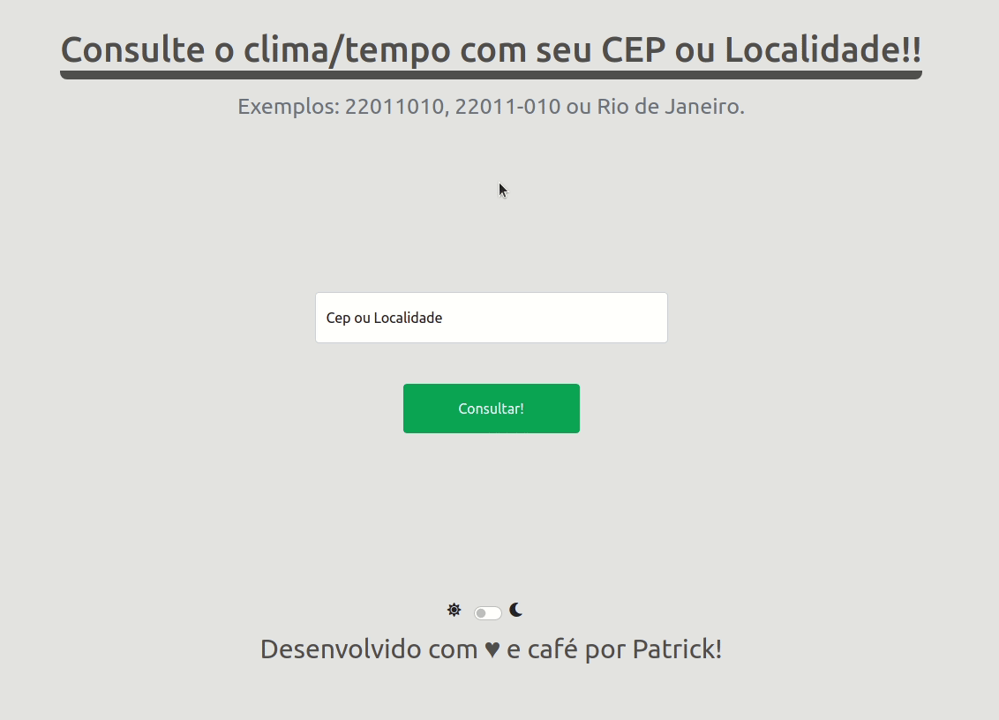

# :scroll: Weather Now Project
## A study project that simulates a weather forecast page. I hope you enjoy!  :grin:

  
  

  

## :rocket: Technologies
This project was developed with the following technologies:   

- :heavy_check_mark: **HTML**
- :heavy_check_mark: **CSS**
  - :boom: **Bootstrap!**
- :heavy_check_mark: **Javascript**
  - :boom: **Weather API**
  - :boom: **cep API**
  

## About this project

The idea about this project is: 
- Create a simple page with dark mode toggle. 
- Generate random greets. 
- Consult local weather 
  - Cep
  - Cities
---
 

### Made with :purple_heart: by Patrick =)  

### Connect with me at [LinkedIn!](https://www.linkedin.com/in/patrick-morais/)